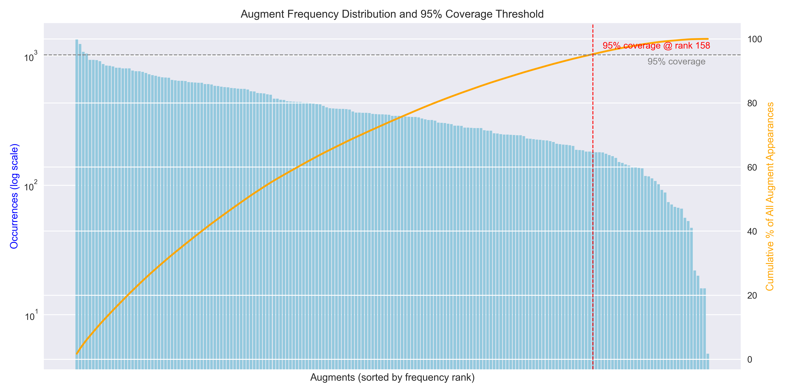
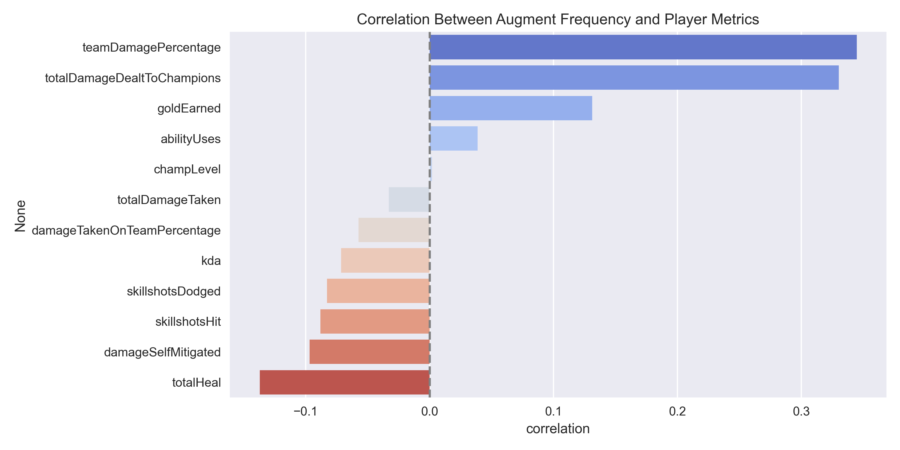
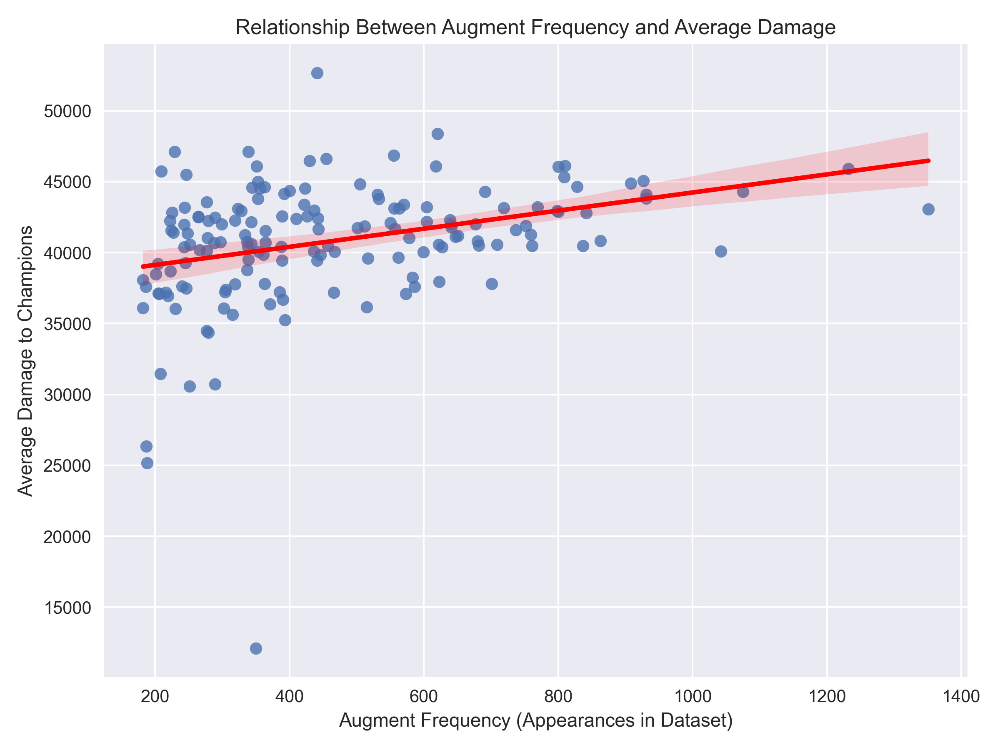
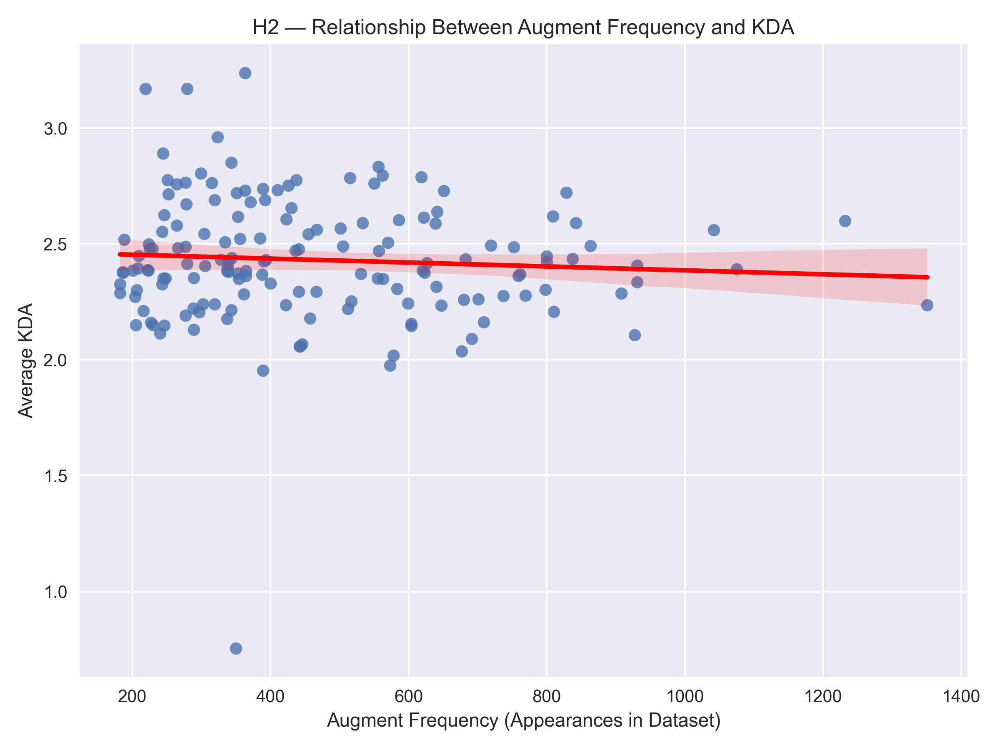
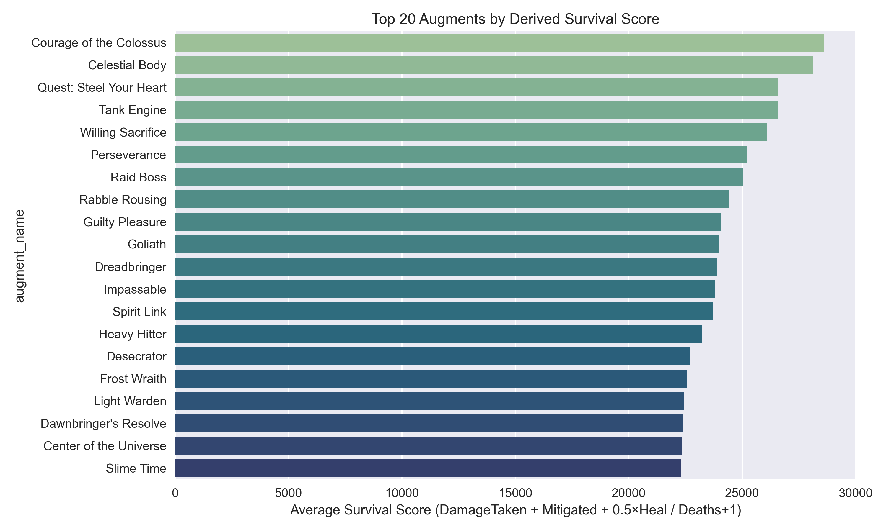
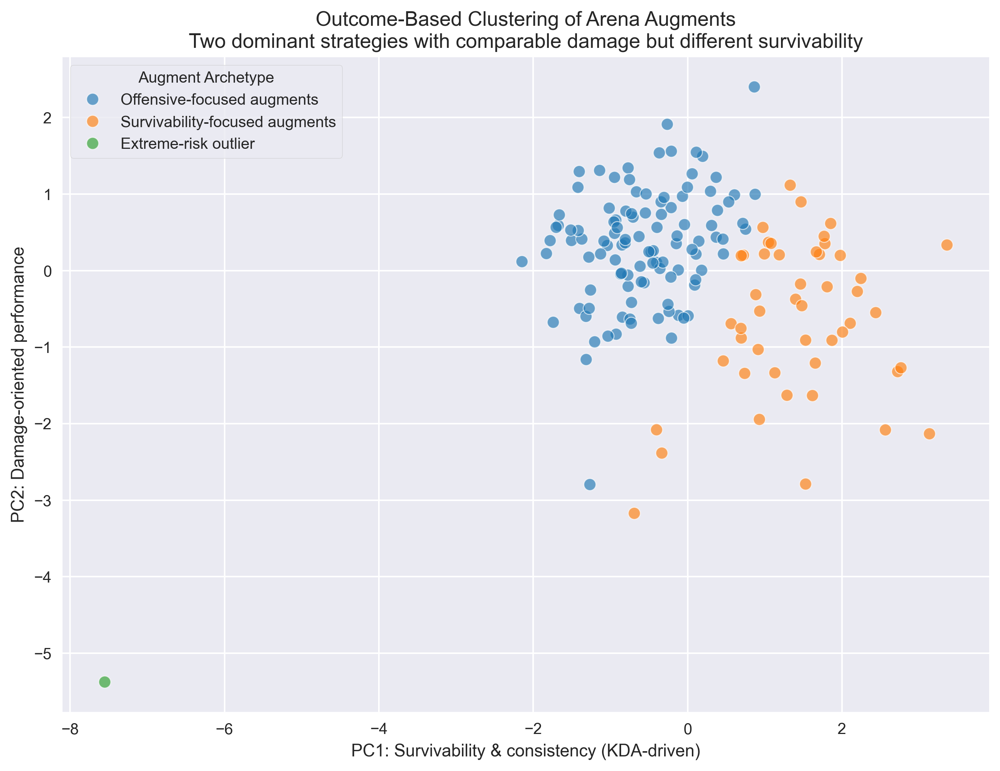
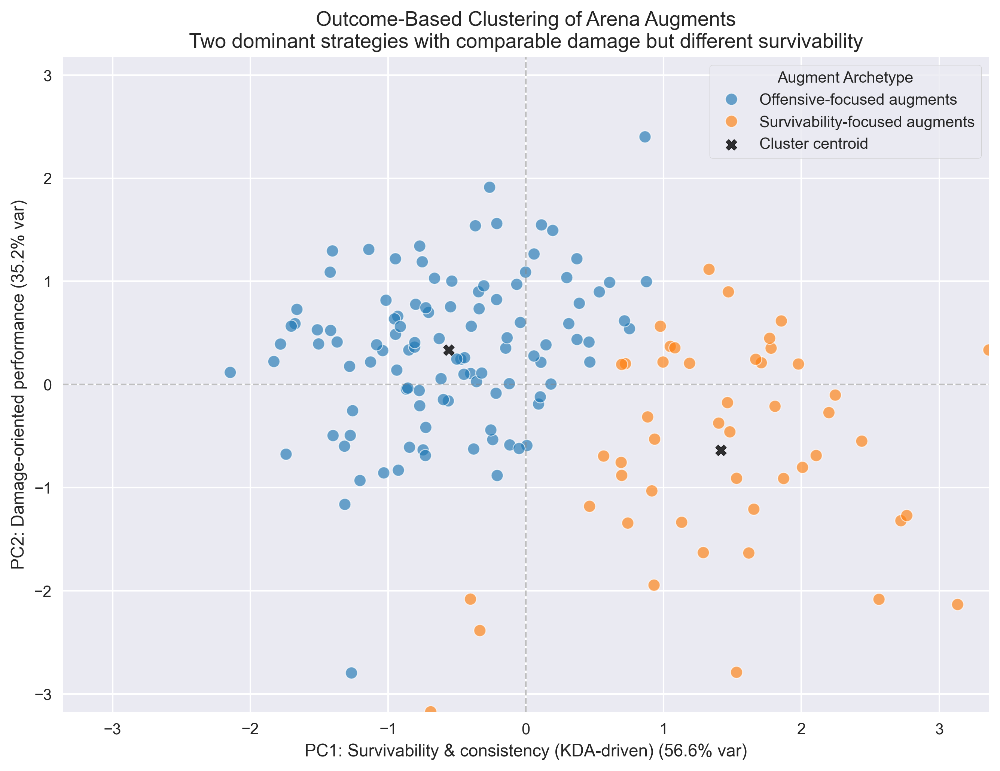
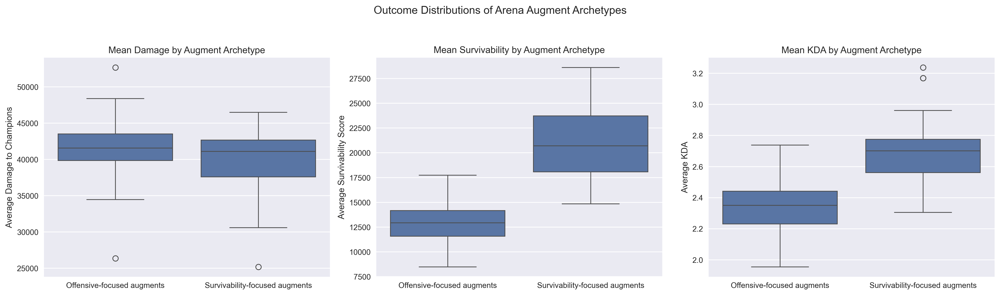

# 🎯 Arena Augment Performance & Survival Analysis
*League of Legends: Arena Data Science Project (DSA210)*  
**Author:** Tuna Özdil 
**Date:** November 2025  

---

## 🧩 Project Overview

This project explores **League of Legends: Arena mode**, introduced in 2023, where each player selects randomized power-ups called **Augments** during matches.  
Augments can drastically alter champion playstyles, strategies, and match outcomes — making them a rich subject for quantitative analysis.

The study investigates how **augment appearance frequency** relates to **player performance metrics**, such as:
- **KDA ratio** (kills + assists ÷ deaths)
- **Total damage dealt to champions**
- **Durability and survivability** (a derived *sustain score* based on healing and damage mitigation)

The dataset represents matches from multiple accounts (myself and consenting friends), providing thousands of Arena match records for analysis.

---

## 🧠 Motivation

Arena is a 2v2v2v2 elimination mode where randomness and adaptation define success.  
Because augments are randomly offered, players often speculate whether certain augments are objectively stronger or simply more common.  

This project aims to **quantify those relationships** by combining statistical testing and exploratory visualization to identify:
- Which augments appear most frequently,
- Whether common augments improve performance,
- And how sustain-focused augments differ statistically from offensive ones.

---

## 📚 Data Source

### **Collection**
All data were gathered **personally** through the official [Riot Games API](https://developer.riotgames.com/docs/lol) under a **personal developer key** for educational use.

- **API Endpoints Used:**
  - `GET /lol/match/v5/matches/by-puuid/{puuid}/ids`
  - `GET /lol/match/v5/matches/{matchId}`
- **Game Mode:** Arena (`queueId = 1700`)
- **Augment Names:** Mapped via [CommunityDragon JSON](https://raw.communitydragon.org/15.23/cdragon/arena/en_us.json)

### **Scope**
Each Arena match includes **16 anonymized player entries** (8 teams of 2).  
Across ~3,000 matches from multiple regions (TR1, NA1, EUW), the dataset expands to **≈ 48,000 player-level entries**.

### **Fields Used**
Only non-identifying, gameplay-relevant fields:
- `championName`, `kills`, `deaths`, `assists`
- `goldEarned`, `totalDamageDealtToChampions`, `damageSelfMitigated`
- `totalHeal`, `teamDamagePercentage`, `abilityUses`
- `playerAugment1–6` (converted to readable names)

> ⚠️ No personally identifiable information (PUUIDs, Riot IDs, usernames, etc.) is stored or shared.  
> Data is anonymized and aggregated before analysis.

### 🔄 Data Enrichment

The raw Riot Games API match data was enriched through multiple derived and aggregated features. Player-level event logs were transformed into augment-centric analytical units by computing derived performance metrics (e.g., KDA and a custom survival score), aggregating outcomes across thousands of augment appearances, and constructing outcome-level representations for unsupervised learning. This enrichment step converts raw gameplay logs into higher-level analytical features suitable for statistical testing and machine learning.


---

## 📊 Data Cleaning and Preparation

- Expanded augment arrays into one record per augment (`explode` transformation).
- Mapped augment IDs → names using the CommunityDragon dataset.
- Dropped incomplete rows and invalid augment entries.
- Filtered out rare augments that together represented less than **5% of total appearances** (noise reduction).
- Combined datasets from three accounts into a unified CSV under `data/players/`.

---
### 📄 Example Data Records

To illustrate the structure of the aggregated dataset (`arena_all.csv`), a simplified excerpt is shown below:

| match_id | player_index | champion | subteamId | kills | deaths | assists | kda | goldEarned | champLevel | totalDamageDealtToChampions | totalDamageTaken | totalHeal | damageSelfMitigated | teamDamagePercentage | damageTakenOnTeamPercentage | abilityUses | skillshotsHit | skillshotsDodged | augment_id | gameDuration | augment_name | rarity |
|---------|--------------|----------|-----------|-------|--------|---------|-----|------------|------------|-----------------------------|------------------|-----------|----------------------|----------------------|------------------------------|--------------|----------------|------------------|------------|--------------|---------------|--------|
| TR1_123456789 | 4 | TahmKench | 6 | 2 | 8 | 5 | 0.88 | 9500 | 15 | 16278 | 36158 | 15240 | 81595 | 0.1105 | 0.1406 | 119 | 24 | 105 | 72 | 1454 | Searing Dawn | 1.0 |
| TR1_123456789 | 5 | Leona | 6 | 5 | 7 | 1 | 0.86 | 12461 | 15 | 24852 | 51752 | 14619 | 93826 | 0.1687 | 0.2012 | 251 | 22 | 78 | 237 | 1454 | Transmute: Gold | 0.0 |

Each row represents a **single augment selection** by a player in an Arena match.  
Player-level performance metrics are repeated across rows when multiple augments are selected in the same match.

This exploded augment representation enables augment-centric aggregation and outcome-based analysis across thousands of matches.


---

## 🔬 Analysis Methodology

The analysis proceeds in three stages:

### **1️⃣ Exploratory Data Analysis (EDA)**
- **Augment frequency distribution** with cumulative coverage curve  
  → identifies frequency of augment preferences.  
- **Correlation sweep** between augment frequency and 12 gameplay metrics.  
- **Regression visualization** for frequency vs. key stats (KDA, damage, sustain).  

### **2️⃣ Hypothesis Testing (Survival/Durability)**
Derived a custom **survival score**:

survival_score = (DamageTaken + DamageSelfMitigated + 0.5 × TotalHeal) / (Deaths + 1)


**H₀:** All augments yield equal survival performance.  
**H₁:** At least one augment significantly differs.  

A one-way **ANOVA test** confirmed statistically significant survival differences among augments (p < 0.001).

### **3️⃣ Hypothesis Testing (Frequency–Performance Relations)**
Two **Pearson correlation** tests examined whether augment popularity aligns with player performance.

| Hypothesis | Variable Relationship | Result | p-value | Conclusion |
|-------------|-----------------------|---------|----------|-------------|
| **H1** | Frequency ↔ Damage | r = **0.33** | 2.4e-05 | ✅ Significant positive correlation |
| **H2** | Frequency ↔ KDA | r = **-0.07** | 0.37 | ❌ No significant relationship |

---

## 📈 Key Visualizations

### **Augment Frequency Distribution (Log Scale)**
After the top 95% of cumulative augment appearances, the remaining augments occur increasingly infrequently. To prevent skewed or noisy results caused by these rare cases, the bottom 5% of augments is removed from the dataset.



---

### **Correlation Between Frequency and Player Metrics**
This graph shows that players tend to favor high-damage augments, reflected by a weak but statistically significant positive correlation with augment frequency, while the remaining performance metrics exhibit little to no meaningful correlation with frequency.


---

### **Augment Frequency vs Damage Output Scatter Plot**
Displays the strongest correlation between augment frequency and any player metric—damage.


---

### **Augment Frequency vs KDA**
Unexpectedly, no meaningful correlation between augment frequency and overall KDA consistency.



---

### **Augments by Survival/Durability**
Derived sustain metric shows clear outliers — some augments clearly enhance durability.



---

## 🧾 Summary of Findings

| Aspect | Finding | Interpretation |
|---------|----------|----------------|
| **Frequency Distribution** | Top 157 augments cover 95% of all appearances | Arena meta favors a wide range of augments |
| **Survival Score** | Significant augment-to-augment variance | Some augments enhance durability disproportionately |
| **Frequency ↔ Damage** | Strong positive correlation (r = 0.33, p < 0.001) | Common augments drive offensive output |
| **Frequency ↔ KDA** | No significant correlation | Popular augments improve raw stats, not consistency |

---

## 🧠 Conclusions

- **Frequent augments ≠ balanced augments:** Frequently selected augments emphasize offensive output, while survivability-oriented augments exhibit distinct outcome profiles.
- **Durability augments are distinct:** Though rarer, they show statistically significant variance in survival contribution.  
- **KDA unaffected by popularity:** Common augments boost raw output but not strategic efficiency.  
- **Arena’s meta skews toward offense, not sustain.**

---


# 🤖 Machine Learning: Outcome-Based Augment Archetypes

While EDA and hypothesis testing focused on pairwise relationships (e.g., frequency vs. damage), these approaches do not capture how multiple performance dimensions jointly characterize augment behavior. To address this limitation, an unsupervised learning approach was applied to identify higher-level **augment archetypes** based on outcome-level performance.

---

### 🎯 ML Objective

The objective of the ML analysis is to determine whether Arena augments naturally group into distinct behavioral categories when considered across multiple performance dimensions simultaneously, without imposing predefined labels such as “offensive” or “defensive.”

---

### 🧩 Feature Construction

Each augment was represented by an aggregated outcome profile computed across all of its appearances:

- Mean damage dealt to champions  
- Mean survivability score
- Mean KDA  

These features capture what an augment achieves in practice, rather than how often it appears or how volatile its outcomes are.  
Augments in the bottom 5% of total appearances were excluded to reduce noise from rare or highly situational cases.

---

### 📐 Dimensionality Reduction

All features were standardized and projected into two dimensions using **Principal Component Analysis (PCA)** for visualization.

- **PC1** is dominated by survivability and KDA, capturing outcome consistency and fight longevity.  
- **PC2** primarily reflects damage-oriented performance.  

Together, the first two principal components explain approximately **91.8% of the total variance**.

---

### 🔍 Clustering Method

K-means clustering was applied in the standardized feature space.  
Model selection was guided by silhouette analysis, with **k = 3** providing the best balance between separation and interpretability.

One cluster consisted of a single extreme-risk augment, **Sacrifice**, which reduces player health by 50% for seven rounds in exchange for a delayed payoff at the end of the seventh round. This augment represents a mechanically distinct design rather than a common strategic archetype.

---
### 📊 Model Diagnostics and Cluster Summary

The final clustering configuration (k = 3) achieved strong separation relative to alternative feature sets, as evaluated using PCA variance coverage and silhouette analysis.

- **Explained variance (PC1, PC2):** 0.566, 0.352  
- **Total variance explained:** 91.8%  
- **Silhouette score (k = 3):** 0.420  

These values indicate that the reduced two-dimensional representation preserves most of the outcome-level structure, and that the resulting clusters exhibit meaningful separation.

---

### 📊 PCA Visualization (Including Extreme-Risk Outlier)



When all clusters are visualized together, the extreme-risk augment dominates the scale of the projection, compressing the remaining structure and obscuring the relationships between commonly used augments.

For this reason, the outlier is retained in quantitative summaries but omitted from the primary visualization below to improve interpretability.

---

### 📊 PCA Visualization of Dominant Augment Archetypes



Two dominant archetypes emerge among commonly selected augments:

- **Offensive-focused augments**  
- **Survivability-focused augments**

Although these archetypes achieve comparable average damage output, they differ substantially in survivability and outcome consistency.

---

### 📦 Outcome Distributions by Archetype



- Damage distributions overlap strongly across archetypes.  
- Survivability-focused augments exhibit significantly higher survivability scores.  
- Higher survivability also corresponds to higher average KDA, indicating greater consistency rather than increased lethality.

---
### 📋 Outcome-Level Cluster Characteristics

The table below summarizes average outcome metrics for each cluster:

| Cluster | Mean Damage | Mean Survivability | Mean KDA | # Augments |
|--------:|------------:|-------------------:|---------:|-----------:|
| 0 | 41,482 | 12,860 | 2.34 | 108 |
| 1 | 39,930 | 20,952 | 2.68 | 48 |
| 2 | 12,101 | 4,938 | 0.75 | 1 |

Clusters 0 (offensive-focused) and 1 (survivability-focused) correspond to the two dominant archetypes discussed above. Although their average damage output is comparable, Cluster 1 exhibits substantially higher survivability, as reflected in the aggregated outcome metrics. Cluster 2 represents the single extreme-risk augment characterized by unusually low survivability and a delayed payoff.


---

### 🧾 ML Summary

Robustness-tested unsupervised clustering shows that Arena augment archetypes are primarily distinguished by survivability and outcome consistency rather than raw damage output or popularity.

---

# 🧠 EDA vs ML Interpretation

The machine learning results refine and contextualize the exploratory findings by revealing structure that is not visible through pairwise analysis alone.

Exploratory Data Analysis showed that players preferentially select high-damage augments, as evidenced by a statistically significant positive correlation between augment frequency and average damage output. This initially suggests that the Arena meta is primarily driven by offensive optimization.

However, the outcome-based clustering reveals a more nuanced picture. Among commonly selected augments, average damage output is relatively homogeneous across clusters, while survivability and outcome consistency emerge as the primary axes of differentiation. In other words, augments that appear equally “offensive” in terms of damage can lead to fundamentally different combat dynamics depending on whether damage is achieved through burst-oriented play or through prolonged engagement enabled by higher durability.

This indicates that popular augments do not form a single offensive class. Instead, similar damage outcomes are achieved through distinct strategic mechanisms: direct offensive pressure versus sustained survivability and fight longevity. The latter is also associated with higher average KDA, suggesting that survivability-focused augments improve consistency and reduce risk rather than increasing raw lethality.

Taken together, these results suggest that player preferences in Arena reflect not only a pursuit of damage, but also an implicit trade-off between risk and consistency, which is not captured by frequency–damage relationships alone.

---

## ⚠️ Limitations and Future Work

### Limitations

- **Limited player pool:** The dataset consists of matches from myself and a small group of consenting friends, which may introduce selection bias and limit generalizability across the full Arena player population.
- **No outcome labels:** Match outcomes (win/loss, placement) are intentionally excluded to comply with Riot Games API Terms of Service, restricting supervised learning approaches.
- **Champion–augment confounding:** Augment performance is partially confounded with champion choice, as certain champions naturally synergize better with specific augments.
- **Derived survivability metric:** The survival score is a constructed proxy combining multiple defensive statistics and does not represent an official or ground-truth measure of survivability.

### Future Work

- Incorporate **champion–augment interaction analysis** to disentangle champion-specific effects from augment impact.
- Analyze **temporal meta shifts** by grouping matches across different Arena patches.
- Extend the dataset using a **larger and more diverse player pool** to improve external validity.
- Apply **supervised learning methods** if outcome labels become permissible in future API releases.

---
## ⚖️ Ethical and Legal Compliance

- All data collected via the **official Riot Games API** using a personal *developer key* for academic, non-commercial use.  
- No personal identifiers or player-specific outcomes (e.g., win/loss, placement) are stored or displayed.  
- The repository includes only **aggregated statistical summaries** and **derived metrics**.  
- Public results comply with Riot’s API Terms of Service — no augment winrates, rankings, or individual outcomes are disclosed.  

> **Riot Games does not endorse or sponsor this project.**

---

## 🧩 Figures
- All figures are automatically saved under figures/.
---
## 📚 References

Riot Games Developer Portal

CommunityDragon Augment Dataset

Assistance from OpenAI’s ChatGPT 5.1 was used during development for code guidance, debugging, and README preparation. Some example prompts used, with answers:
- Prompt:
“My PCA plot has the origin off-center even though the data is standardized. How can I fix this?”
- Output:
Applied axis-centering and symmetric scaling techniques to improve visualization clarity without altering results.
- Prompt:
“Rewrite this ML section to be suitable for an academic README.”

- Output:
Used to improve clarity, structure, and tone of the README while preserving author-written content and conclusions.

## 🧰 Setup & Reproducibility

### Environment
- Python ≥ 3.10  
- Development environment: VS Code  
- Execution format: standard Python scripts (`.py`)

---

### Required Packages

The analysis relies on the following Python libraries:

- `pandas`
- `numpy`
- `matplotlib`
- `seaborn`
- `scipy`
- `scikit-learn`
- `requests`

Install dependencies using:

```bash
pip install -r requirements.txt


